# LiveGuard

[中文](README.md) · [English](README_EN.md)

[](https://github.com/sdaAlbert/liveguard/actions/workflows/ci.yml)

> 一个用 Go 构建的个人直播监控 Agent：每个直播 URL 是一扇监控小窗，用户用自然语言说明关注目标，系统只在重要时刻出现时提醒。

LiveGuard 面向不想一直挂着直播的个人用户。粘贴一个直播地址，再描述“抽奖开始时提醒我”“进入决胜团战时提醒我”或任意自定义需求，就会创建一张独立监控卡片。多个窗口可以同时运行，持续把口播和画面文字压缩成少量个人提醒。

Agent 不只查找固定关键词：模糊预告会继续等待，ASR 与 OCR 可以交叉印证，否定语义不会误报，重复播报会被去重，登录验证会交给用户处理。默认使用确定性 ASR/OCR 事件回放，因此无需 API Key 也能复现完整判断过程。


## 用户如何使用

1. 输入直播 URL 和一句自然语言关注需求。
2. LiveGuard 在总监控室中打开一张独立监控卡片。
3. 感知层接收该直播间的 ASR 字幕和 OCR 画面文字。
4. Agent 只调查与用户需求相关的候选信号，决定等待、复核、忽略或提醒。
5. 用户可以继续添加其他直播 URL，在一个页面查看所有窗口。

每张卡片都显示最新信号、命中提醒、证据、可信度和 Agent 工具路径。

## 本地运行

需要 Windows、Go、Google Chrome、Docker Desktop，以及支持 `docker compose up --wait` 的 Compose v2。在仓库根目录执行：

```powershell
powershell -ExecutionPolicy Bypass -File .\scripts\demo.ps1
```

- 个人直播监控室：<http://127.0.0.1:8080>
- 单次页面检查工具：<http://127.0.0.1:8080/inspect>
- Jaeger：<http://127.0.0.1:16686>

在首页输入不同直播地址和需求，可以同时打开最多 8 张监控卡片。当前卡片中的信号来自与需求匹配的确定性回放，目的是验证多窗口状态、Agent 分支、证据合并和去重；单次页面检查工具可以读取真实页面。

```powershell
powershell -ExecutionPolicy Bypass -File .\scripts\demo.ps1 status
powershell -ExecutionPolicy Bypass -File .\scripts\demo.ps1 stop
```

## 架构

```mermaid
flowchart LR
    U[Personal Control Room] -->|HTTP: URL + natural-language goal| C[Go Control Plane]
    S[ASR / OCR Signal] --> M[Agent Investigation Runtime]
    M -->|wait / review / dedupe / alert| U
    C -->|SSE updates| U
    M --> MR[(PostgreSQL Monitor Runs)]
    C --> T[(PostgreSQL Agent Tasks)]
    T --> W[Bounded-concurrency Task Worker]
    W --> B[Chrome Evidence Runner]
    B --> A[Agent Tool Proposal]
    A --> P[Policy Gateway]
    P -->|approved| DB[(PostgreSQL + Outbox)]
    DB --> Q[(Redis Streams)]
    Q -->|consume / reclaim| G[gRPC Sandbox Worker]
    G --> D[Restricted Docker Sandbox]
    C -. OTLP .-> O[OpenTelemetry Collector]
    G -. OTLP .-> O
    O --> J[Jaeger]
```



## 验证入口

| 范围 | 公开证据 |
|---|---|
| Agent 动态决策 | [个人多窗口信号回放与分支测试](internal/monitor/service_test.go)：自然语言需求、等待、跨模态复核、否定抑制、去重和提醒 |
| 路由与策略 | [6 个固定的确定性回归案例](internal/agent/eval.go)，当前 CI 全部通过 |
| 批量调度 | [12 个直播间的本地负载验收](docs/LOAD-TEST.md)：4 并发下 12/12 通过，记录 P50/P95 与吞吐 |
| Sandbox 策略 | [正常、只读、断网、超时四个 Docker 场景](internal/sandbox/sandbox.go)，本地验收全部通过并清理容器 |
| 跨进程追踪 | 下图展示控制面、Redis、gRPC Worker 与 Docker spans |
| 自动化检查 | [GitHub Actions](https://github.com/sdaAlbert/liveguard/actions/workflows/ci.yml) 运行 `go test`、`go vet` 和前端语法检查 |


## 关键取舍

- **Redis Streams**：适合当前单机任务调度所需的 Consumer Group、Pending 与失败重领；如果需要更高吞吐、长时间保留和多消费者分发，再评估 Kafka。
- **Transactional Outbox**：保证已授权的 Sandbox Run 与投递意图同时提交，发布失败后可以重新扫描。
- **Policy before execution**：模型输出和页面内容都按不可信输入处理，执行参数由服务端固定。
- **有界并发与重试**：浏览器任务默认最多 4 个并发；浏览器、RPC、Sandbox 瞬时故障按 2s/4s 退避，最多执行 3 次。批次只统计每个直播间最新一次结果。

实现细节见 [直播信号 Agent](docs/DESIGN-LIVE-SIGNAL-AGENT.md)、[Outbox 与 Redis Streams](docs/DESIGN-OUTBOX-STREAMS.md) 和 [Policy Gateway 与 Sandbox](docs/DESIGN-POLICY-SANDBOX.md)。

## 当前边界

- 默认演示使用确定性 Agent。Responses API Tool Calling 已接入，但尚未完成在线模型准确率与延迟评测。
- 监控卡片当前使用与用户需求匹配的可复现 ASR/OCR 事件回放；尚未接入真实直播流切片、whisper.cpp 或 PaddleOCR，不能宣称已经监控真实直播音视频。
- Durable 模式已将 Agent 主任务写入 PostgreSQL；非 Durable 开发模式仍回退到本地 JSONL。当前没有按检查项 checkpoint，也没有多控制面实例抢占协议。
- 当前是单 Sandbox Worker，没有多 Worker 压测、HA、服务认证或 TLS。
- Sandbox 只运行服务端预定义诊断；Docker 共享宿主机内核，不是强隔离的任意代码执行平台。

安全模型见 [SECURITY.md](SECURITY.md)，开发与在线模型配置见 [CONTRIBUTING.md](CONTRIBUTING.md)。

## License

[Apache-2.0](LICENSE)
