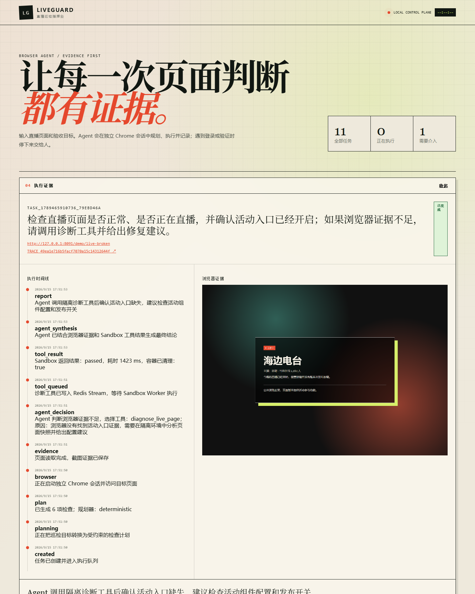
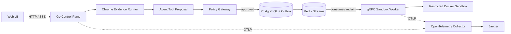
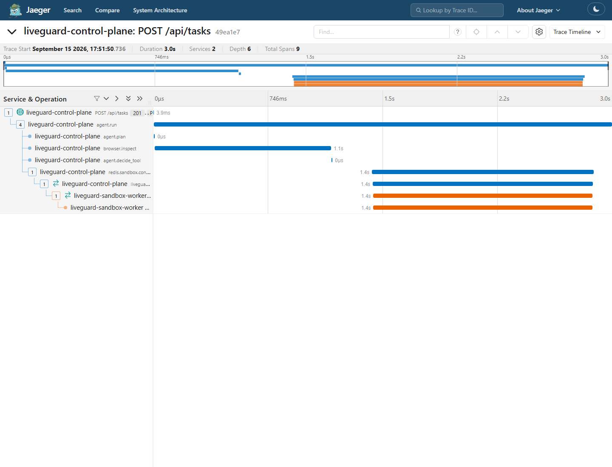

# LiveGuard

[中文](README.md) · [English](README_EN.md)

[](https://github.com/sdaAlbert/liveguard/actions/workflows/ci.yml)

> 一个用 Go 构建的、受策略约束的 Agent 工具执行链：浏览器采集证据，决策层提出工具调用，服务端授权，Docker Sandbox 隔离执行。

LiveGuard 用“直播页面巡检”展示从浏览器证据到持久化 Sandbox 任务的完整链路。默认演示使用确定性决策，便于离线复现；Responses API Tool Calling 已接入，但在线模型效果尚未评测。这是架构参考实现，不是生产平台。

运营人员可以把必须出现的文案和预期直播状态作为验收口径。系统输出 `passed`、`failed`、`unverified` 或 `needs_human` 业务结论；遇到登录或验证码时，由运营人员在隔离的专用 Chrome 配置中处理，随后一键复测原任务。



## 一次任务如何执行

1. Chrome 读取直播页面并保存标题、可见文本和截图证据。
2. 决策层根据证据判断是否请求预定义工具 `diagnose_live_page`。
3. Policy Gateway 校验工具白名单、用户目标、证据和人工接管状态。
4. PostgreSQL 在同一事务中写入 Sandbox Run 与 Outbox，随后发布到 Redis Streams。
5. gRPC Worker 在受限 Docker 容器中分析已裁剪的页面证据。
6. 工具结果更新任务报告；同一 Trace ID 串联 HTTP、Agent、Redis、gRPC 和 Docker。

决策层只能请求预定义工具，不能指定命令、镜像、挂载、网络或 Docker 参数。

## 本地运行

需要 Windows、Go、Google Chrome、Docker Desktop，以及支持 `docker compose up --wait` 的 Compose v2。在仓库根目录执行：

```powershell
powershell -ExecutionPolicy Bypass -File .\scripts\demo.ps1
```

- 控制台：<http://127.0.0.1:8080>
- Jaeger：<http://127.0.0.1:16686>

在控制台粘贴直播间地址，选择预期直播状态，并按需填写主播昵称或活动文案。报告只向运营展示业务结论、页面截图和检查结果。需要检查真实抖音登录页时，先打开专用登录窗口、手动登录并关闭窗口，再开始巡检。

```powershell
powershell -ExecutionPolicy Bypass -File .\scripts\demo.ps1 status
powershell -ExecutionPolicy Bypass -File .\scripts\demo.ps1 stop
```

## 架构



## 验证入口

| 范围 | 公开证据 |
|---|---|
| 路由与策略 | [6 个固定的确定性回归案例](internal/agent/eval.go)，当前 CI 全部通过 |
| Sandbox 策略 | [正常、只读、断网、超时四个 Docker 场景](internal/sandbox/sandbox.go)，本地验收全部通过并清理容器 |
| 跨进程追踪 | 下图展示控制面、Redis、gRPC Worker 与 Docker spans |
| 自动化检查 | [GitHub Actions](https://github.com/sdaAlbert/liveguard/actions/workflows/ci.yml) 运行 `go test`、`go vet` 和前端语法检查 |



## 关键取舍

- **Redis Streams**：适合当前单机任务调度所需的 Consumer Group、Pending 与失败重领；如果需要更高吞吐、长时间保留和多消费者分发，再评估 Kafka。
- **Transactional Outbox**：保证已授权的 Sandbox Run 与投递意图同时提交，发布失败后可以重新扫描。
- **Policy before execution**：模型输出和页面内容都按不可信输入处理，执行参数由服务端固定。

实现细节见 [Outbox 与 Redis Streams](docs/DESIGN-OUTBOX-STREAMS.md) 和 [Policy Gateway 与 Sandbox](docs/DESIGN-POLICY-SANDBOX.md)。

## 当前边界

- 默认演示使用确定性 Agent。Responses API Tool Calling 已接入，但尚未完成在线模型准确率与延迟评测。
- 浏览器任务仍使用本地 JSONL，没有按检查项 checkpoint 或多实例写入。
- 当前是单 Sandbox Worker，没有多 Worker 压测、HA、服务认证或 TLS。
- Sandbox 只运行服务端预定义诊断；Docker 共享宿主机内核，不是强隔离的任意代码执行平台。

安全模型见 [SECURITY.md](SECURITY.md)，开发与在线模型配置见 [CONTRIBUTING.md](CONTRIBUTING.md)。

## License

[Apache-2.0](LICENSE)
