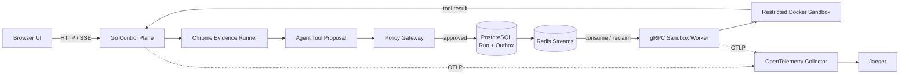

# LiveGuard

[中文](README.md) · [English](README_EN.md)

[](https://github.com/sdaAlbert/liveguard/actions/workflows/ci.yml)

> A Go reference implementation for livestream page inspection: the browser collects evidence, the model proposes a tool, the policy layer authorizes it, and a sandbox executes it through a pipeline with durable delivery, policy audit, and distributed tracing.

LiveGuard is not a chatbot or a general browser automation framework. It uses one concrete workflow to answer an engineering question: **how can an unreliable model call real tools safely, durably, and observably?**


## What happens in one run

1. A user submits a livestream page and an inspection objective.
2. An isolated Chrome session collects the title, visible text, livestream state, and screenshot evidence.
3. The agent decides whether to propose `diagnose_live_page`.
4. A server-side Policy Gateway component validates the tool allowlist, objective, evidence, and human-intervention state.
5. An approved run and its Outbox entry are committed atomically to PostgreSQL, then delivered through Redis Streams.
6. A gRPC Sandbox Worker passes the already collected, bounded page evidence to a predefined diagnostic inside a restricted Docker container; the container does not fetch the target page.
7. The result updates the report, while one Trace ID connects HTTP, agent, Redis, gRPC, and Docker spans.

The model can propose an action but cannot choose a command, image, mount, Docker option, or network policy. A deterministic fallback keeps the local workflow testable when the model is unavailable.

## One-command local demo

The one-command path targets Windows with Go, Google Chrome, a Compose v2 release that supports `docker compose up --wait`, and a running Docker Desktop. Run it from the repository root. It uses deterministic mode, so `.env.local`, an API key, and online model access are not required. Initial image and module downloads depend on network speed.

```powershell
powershell -ExecutionPolicy Bypass -File .\scripts\demo.ps1
```

Add `-OpenBrowser` to open the dashboard automatically.

Open the dashboard at <http://127.0.0.1:8080> and Jaeger at <http://127.0.0.1:16686>. Load the missing-activity-entry scenario and start a task. A successful run shows `SOURCE=deterministic`, an approved `diagnose_live_page` call, the activity check changing from `unverified` to `failed`, a completed Sandbox Run, and a Trace ID. Search that Trace ID in Jaeger to inspect control-plane and worker spans.

The Agent Eval section should pass 6/6 routing and policy cases. Sandbox Lab should pass 4/4 real-container checks for non-root execution, a read-only root filesystem, disabled networking, and timeout termination.

```powershell
powershell -ExecutionPolicy Bypass -File .\scripts\demo.ps1 status
powershell -ExecutionPolicy Bypass -File .\scripts\demo.ps1 stop
```

See [CONTRIBUTING.md](CONTRIBUTING.md) for manual startup and development checks.

If startup fails, inspect `runtime/demo/*.err.log`. The default ports are `8080`, `9090`, `4317`, `5433`, `6380`, and `16686`. `stop` stops the two tracked Go processes and Compose services while preserving PostgreSQL and Redis volumes. Use `docker compose down -v` only when you want to delete local data.

## Architecture



Within the project's process boundary, only the loopback-bound Sandbox Worker accesses the Docker daemon. PostgreSQL is the source of truth for Sandbox Runs, Redis Streams provides asynchronous delivery and pending-entry reclaim, gRPC defines the execution boundary, and trace context crosses both Redis and gRPC. Browser tasks still use a local JSONL store.

## Implemented and verified

- Responses API strict function calling with call ID and token audit.
- Independent Policy Gateway with allowlist, evidence, objective, and human-intervention checks.
- PostgreSQL Transactional Outbox, idempotency keys, and request-hash conflict detection.
- Redis Streams consumer group, `XAUTOCLAIM`, pending entries, and DLQ.
- gRPC deadlines, health checks, concurrency limits, and stale-result fencing.
- Restricted Docker execution: non-root, read-only root filesystem, no network, all capabilities dropped, `no-new-privileges`, resource/time/output limits, and cleanup.
- OpenTelemetry traces across HTTP, agent, Redis, gRPC, and Docker.
- Six Agent routing/policy evals and four real Sandbox policy checks.
- Shared circuit breaker and deterministic fallback for model failures.

```powershell
go test ./...
go vet ./...
node --check internal/web/static/app.js
```

The JavaScript syntax check requires Node.js 22 or newer.

## Design choices

**Redis Streams instead of Kafka.** The current workload needs a small local deployment, consumer groups, pending entries, and reclaim. Kafka would make sense for higher throughput, longer retention, and broader event fan-out. It is not used by this project.

**Policy before execution.** Page content and model output are untrusted. The model selects only from a strict schema; the server owns commands, images, resources, and network policy.

**Transactional Outbox.** A run and its delivery intent commit in one PostgreSQL transaction. A publisher retries unpublished rows, closing the database-to-queue crash window.

Read [Outbox and Redis Streams](docs/DESIGN-OUTBOX-STREAMS.md) and [Policy Gateway and Sandbox](docs/DESIGN-POLICY-SANDBOX.md) for the detailed reasoning.

## Security boundary

LiveGuard is a local reference implementation, not a hardened multi-tenant service. HTTP and gRPC use loopback without production authentication or TLS. Docker shares the host kernel and is not equivalent to Firecracker, gVisor, or Kata. The project accepts predefined diagnostics only, not arbitrary model-generated code. Online model behavior requires separate evaluation; `deterministic_fallback` is not evidence of model accuracy. The project uses Redis Streams, not Kafka. See [SECURITY.md](SECURITY.md).

## Repository map

```text
cmd/liveguard/          Go control plane and web server
cmd/sandbox-worker/     gRPC worker with Docker access
internal/agent/         planning, tool routing, policy, evals, circuit breaker
internal/browser/       Chrome evidence collection
internal/sandbox/       Outbox, Redis Streams, leases, container lifecycle
internal/sandboxrpc/    gRPC client/server adapters
internal/web/           HTTP API, SSE, embedded dashboard
api/sandbox/v1/         protobuf execution contract
docs/                   design notes and verification reports
```

## Optional online model mode

```powershell
Copy-Item .env.example .env.local
```

Set `OPENAI_API_KEY` locally and change `LIVEGUARD_LLM_MODE` to `auto`. The default model is `gpt-5.6-luna`; override it with `LIVEGUARD_MODEL`. A successful online decision shows `SOURCE=openai:<model>`; `deterministic_fallback` means the provider call failed. The application does not print the key. Local environment, state, browser profiles, screenshots, and build caches are gitignored, but the staged tree and Git history should still be scanned before publication.

The one-command script always forces deterministic mode and does not honor `auto` from `.env.local`. To validate online routing, start the worker and control plane separately using the [manual startup steps](CONTRIBUTING.md#start-processes-manually).

## Documentation

- [Project scope and progress](PROJECT.md)
- [Phase 5 gRPC and OpenTelemetry report](docs/PHASE-5-RPC-OTEL-REPORT.md)
- [Phase 6 Tool Calling, Policy, and Eval report](docs/PHASE-6-TOOL-CALLING-EVAL-REPORT.md)
- [Open-source landscape research](docs/OPEN-SOURCE-RESEARCH.md)
- [Contributing](CONTRIBUTING.md)

## License

[Apache-2.0](LICENSE)
