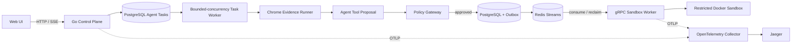

# LiveGuard

[中文](README.md) · [English](README_EN.md)

[](https://github.com/sdaAlbert/liveguard/actions/workflows/ci.yml)

> A policy-gated agent tool execution pipeline in Go: a browser collects evidence, a decision layer proposes a tool, server-side policy authorizes it, and a Docker sandbox executes it.

LiveGuard uses livestream page inspection to demonstrate the path from browser evidence to a durable sandbox job. One campaign can contain 1-50 rooms; a bounded-concurrency worker executes them while PostgreSQL persists task state, retry attempts, and reports. The default demo uses deterministic decisions for offline reproducibility. Responses API tool calling is integrated, but online model behavior has not been evaluated. This is an architecture reference, not a production platform.

Operators can define required visible copy and an expected live status as an acceptance contract. The report returns a `passed`, `failed`, `unverified`, or `needs_human` business verdict. Login or challenge pages are handled in a dedicated Chrome profile, after which the same task can be retried with one click.


## How a task runs

1. Chrome collects the page title, visible text, and screenshot evidence.
2. The decision layer determines whether to request the predefined `diagnose_live_page` tool.
3. A Policy Gateway checks the allowlist, objective, evidence, and human-intervention state.
4. PostgreSQL commits the Sandbox Run and Outbox entry together, then publishes through Redis Streams.
5. A gRPC Worker analyzes bounded page evidence inside a restricted Docker container.
6. The result updates the task report while one Trace ID connects HTTP, agent, Redis, gRPC, and Docker spans.

The decision layer can request only predefined tools and cannot choose commands, images, mounts, network access, or Docker options.

## Run locally

The one-command path requires Windows, Go, Google Chrome, Docker Desktop, and a Compose v2 release with `docker compose up --wait` support. From the repository root:

```powershell
powershell -ExecutionPolicy Bypass -File .\scripts\demo.ps1
```

- Dashboard: <http://127.0.0.1:8080>
- Jaeger: <http://127.0.0.1:16686>

Choose a single inspection or a batch, paste livestream URLs, select the expected live status, and optionally enter a host name or campaign copy. Campaigns aggregate passed, attention, running, and retrying rooms; each task report shows the verdict, screenshot, and check results. For authenticated Douyin pages, open the dedicated login window, sign in manually, close that window, and then start the inspection.

```powershell
powershell -ExecutionPolicy Bypass -File .\scripts\demo.ps1 status
powershell -ExecutionPolicy Bypass -File .\scripts\demo.ps1 stop
```

## Architecture



## Verification entry points

| Scope | Public evidence |
|---|---|
| Routing and policy | [Six fixed deterministic regression cases](internal/agent/eval.go), all passing in the current CI run |
| Batch scheduling | [Local 12-room load acceptance](docs/LOAD-TEST.md): 12/12 passed at concurrency 4 with P50/P95 and throughput recorded |
| Sandbox policy | [Four Docker scenarios for normal, read-only, no-network, and timeout execution](internal/sandbox/sandbox.go), all passing locally with container cleanup |
| Cross-process tracing | The screenshot below shows control-plane, Redis, gRPC worker, and Docker spans |
| Automated checks | [GitHub Actions](https://github.com/sdaAlbert/liveguard/actions/workflows/ci.yml) runs `go test`, `go vet`, and the browser JavaScript syntax check |


## Design choices

- **Redis Streams** fits the current single-node scheduler's need for consumer groups, pending entries, and reclaim. Kafka becomes relevant if throughput, retention, or consumer fan-out grows.
- **Transactional Outbox** commits an approved Sandbox Run and its delivery intent together so failed publication can be retried.
- **Policy before execution** treats model output and page content as untrusted while the server owns every execution parameter.
- **Bounded concurrency and retries** cap browser work at four concurrent tasks by default. Transient browser, RPC, and sandbox failures back off for up to three attempts, and campaign summaries keep the latest result per room.

Read [Outbox and Redis Streams](docs/DESIGN-OUTBOX-STREAMS.md) and [Policy Gateway and Sandbox](docs/DESIGN-POLICY-SANDBOX.md) for implementation details.

## Current boundaries

- The default demo uses a deterministic agent. Responses API tool calling is integrated, but online model accuracy and latency have not been evaluated.
- Durable mode stores primary agent tasks in PostgreSQL; non-durable development mode falls back to local JSONL. Per-check checkpoints and a multi-control-plane claim protocol are not implemented.
- The current deployment has one Sandbox Worker without multi-worker load tests, HA, service authentication, or TLS.
- The sandbox runs predefined diagnostics only. Docker shares the host kernel and is not a hardened arbitrary-code execution platform.

Read [SECURITY.md](SECURITY.md) for the security model and [CONTRIBUTING.md](CONTRIBUTING.md) for development and online-model setup.

## License

[Apache-2.0](LICENSE)
