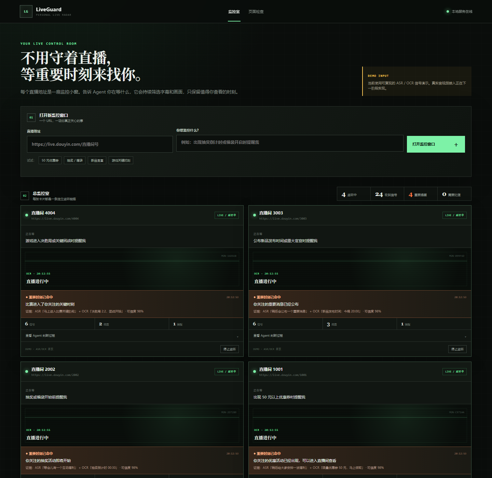

# LiveGuard

[中文](README.md) · [English](README_EN.md)

[](https://github.com/sdaAlbert/liveguard/actions/workflows/ci.yml)

> A personal livestream monitoring agent in Go. Each livestream URL becomes a monitor window; the user describes what matters in natural language, and LiveGuard surfaces only matching moments.

LiveGuard is for people who follow several shopping, launch-event, giveaway, or gaming streams without wanting to keep every page open. Paste a livestream URL and write a goal such as “notify me when the giveaway starts” or “tell me when the match reaches the final team fight.” Each request becomes an independent card in one control room, with up to eight cards running concurrently.

The agent does more than literal keyword matching. It can wait on an ambiguous hint, combine ASR and OCR evidence, suppress negated statements, deduplicate repeated announcements, and ask the user to handle a login challenge. Every decision exposes its evidence, confidence, and tool path.



## User flow

1. Enter a livestream URL and a natural-language monitoring goal.
2. LiveGuard opens an independent card in the personal control room.
3. The perception boundary receives ASR captions and OCR text for that stream.
4. The agent investigates only signals relevant to the user's goal and chooses to wait, review, suppress, or alert.
5. Add more URLs and inspect all active monitors from the same page.

The default demo uses deterministic ASR/OCR event replays, so it needs no API key and remains reproducible offline.

## Run locally

The one-command path requires Windows, Go, Google Chrome, Docker Desktop, and Docker Compose v2 with `docker compose up --wait`.

```powershell
powershell -ExecutionPolicy Bypass -File .\scripts\demo.ps1
```

- Personal control room: <http://127.0.0.1:8080>
- One-shot page inspection utility: <http://127.0.0.1:8080/inspect>
- Jaeger: <http://127.0.0.1:16686>

```powershell
powershell -ExecutionPolicy Bypass -File .\scripts\demo.ps1 status
powershell -ExecutionPolicy Bypass -File .\scripts\demo.ps1 stop
```

## Architecture

```mermaid
flowchart LR
    U[Personal Control Room] -->|URL + goal over HTTP| C[Go Control Plane]
    S[ASR / OCR Signal] --> M[Agent Investigation Runtime]
    M -->|wait / review / dedupe / alert| U
    M --> MR[(PostgreSQL Monitor Runs)]
    C --> T[(PostgreSQL Agent Tasks)]
    T --> W[Bounded-concurrency Task Worker]
    W --> B[Chrome Evidence Runner]
    B --> A[Agent Tool Proposal]
    A --> P[Policy Gateway]
    P -->|approved| DB[(PostgreSQL + Outbox)]
    DB --> Q[(Redis Streams)]
    Q -->|consume / reclaim| G[gRPC Sandbox Worker]
    G --> D[Restricted Docker Sandbox]
    C -. OTLP .-> O[OpenTelemetry Collector]
    G -. OTLP .-> O
    O --> J[Jaeger]
```



## Verification entry points

| Scope | Public evidence |
|---|---|
| Goal-aware agent decisions | [Multi-window signal replay tests](internal/monitor/service_test.go) cover separate natural-language goals, waiting, cross-modal review, negation, deduplication, and alerts |
| Routing and policy | [Six deterministic regression cases](internal/agent/eval.go) |
| Batch scheduling | [Local 12-room load acceptance](docs/LOAD-TEST.md): 12/12 passed at concurrency 4 with P50/P95 and throughput recorded |
| Sandbox policy | [Normal, read-only, no-network, and timeout Docker scenarios](internal/sandbox/sandbox.go) |
| Automated checks | [GitHub Actions](https://github.com/sdaAlbert/liveguard/actions/workflows/ci.yml) runs tests, vet, and browser JavaScript syntax checks |

## Design choices

- **Goal-scoped state:** every monitor persists its URL, natural-language goal, raw signals, investigations, tool steps, and alerts.
- **Redis Streams:** consumer groups, pending entries, and reclaim fit the current task scheduler. Kafka becomes relevant with greater throughput, retention, or consumer fan-out.
- **Transactional Outbox:** an approved Sandbox Run and its delivery intent commit together so publication can be retried.
- **Policy before execution:** model output and page content are untrusted; the server owns execution parameters.
- **Bounded concurrency and retries:** browser work is capped at four tasks, while personal monitors are capped at eight active windows.

Read [the live-signal agent design](docs/DESIGN-LIVE-SIGNAL-AGENT.md), [Outbox and Redis Streams](docs/DESIGN-OUTBOX-STREAMS.md), and [Policy Gateway and Sandbox](docs/DESIGN-POLICY-SANDBOX.md).

## Current boundaries

- Monitor cards currently use deterministic ASR/OCR event replays tailored to the user's goal. Real stream segmentation, whisper.cpp, and PaddleOCR are not connected yet.
- The replay demonstrates goal parsing, state transitions, evidence combination, deduplication, persistence, and multi-window presentation. It must not be described as real livestream audio/video monitoring.
- Responses API tool calling exists in the page-inspection path, but online model accuracy and latency have not been evaluated.
- The current deployment has one Sandbox Worker without HA, service authentication, or TLS.
- Docker runs predefined diagnostics and shares the host kernel; it is not a hardened arbitrary-code sandbox.

Read [SECURITY.md](SECURITY.md) for the security model and [CONTRIBUTING.md](CONTRIBUTING.md) for setup.

## License

[Apache-2.0](LICENSE)
