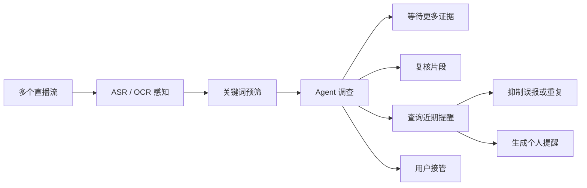

# 直播信号 Agent：设计与边界

## 要解决的问题

个人用户可能同时关注带货、发布会、抽奖和游戏直播，却不想一直挂着多个页面。LiveGuard 让用户为每个直播 URL 写一句关注需求，并在同一个监控室里打开多张独立卡片。每张卡片把连续直播信号压缩成少量值得查看的提醒。

1. **低成本感知层**持续产出 ASR 字幕和 OCR 画面文字；
2. **Agent 调查层**只处理关键词预筛出的候选事件，动态决定等待、复核、去重、提醒或转人工。

Agent 的价值不是替人打开页面，而是把大量连续信号压缩成少量可行动提醒。

## 决策过程

Agent 只在出现候选信号时运行，不会对每一秒视频调用大模型。当前运行时提供五个语义明确的工具：

| 工具 | 使用条件 | 作用 |
|---|---|---|
| `read_live_window` | 任意候选事件 | 读取同一直播间最近的 ASR/OCR 证据窗口 |
| `query_recent_alerts` | 证据足够准备告警 | 检查同类事件是否已经提醒 |
| `reanalyze_clip` | 低置信度或跨模态证据 | 对音频和画面结论做二次校准 |
| `create_alert` | 事件确认且未重复 | 生成带证据和置信度的个人提醒 |
| `request_human_takeover` | 登录或安全验证 | 暂停该直播间并通知用户处理 |

同样包含关注目标的文字会走不同路径。以优惠券为例：

- “等一下给大家一波福利”信息不足，状态保持为 `waiting_more_evidence`；
- 随后 OCR 读到“限量优惠券 50 元”，跨模态证据一致，Agent 复核并提醒；
- “今天没有优惠券”命中否定语义，状态为 `suppressed`；
- 已提醒后再次听到同类口播，查询近期记录并去重；
- OCR 看到安全验证，状态为 `needs_human`。

## 状态和一致性

每次监控 Run 保存直播间、原始信号、调查、工具步骤和提醒。Durable 模式将一整个小型演示 Run 作为 JSONB 快照保存到 PostgreSQL，并通过 `SELECT ... FOR UPDATE` 串行修改同一 Run，避免并发更新丢失。服务重启时，未完成 Run 会被恢复为 `stopped`，不会伪装成仍在运行。

这个存储设计适合当前可复现演示。生产环境会把高频信号拆到事件表或时序存储，把音视频片段放到对象存储，并按 `room_id + event_type + time_window` 建立跨 Run 的幂等键。

## 当前可运行范围

首页监控室的演示信号由确定性回放源产生，因此不需要购买 ASR、OCR 或 LLM API，也能稳定验证状态机、动态工具选择、证据合并、去重和用户接管。感知接口已抽象为 `Transcriber`、`TextRecognizer` 和 `SignalSource`，下一阶段可以接入本地 `whisper.cpp` 与 PaddleOCR，而不改变 Agent 运行时。

当前单次页面检查能力仍可用于真实页面的证据采集；直播音视频流接入、切片和本地模型推理尚未实现，不应把回放演示描述成真实直播监控。
